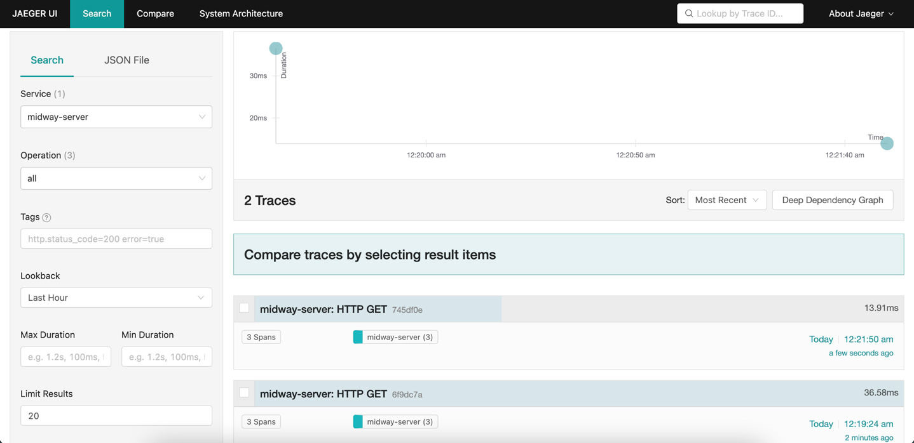
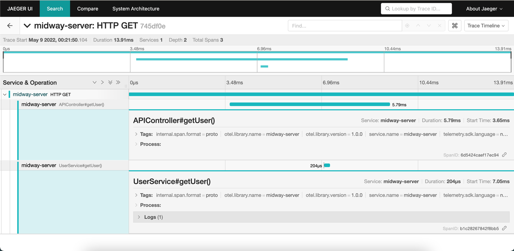

# otel-midway

## 简介
使用阿里的 node.js 框架 [Midway](https://midwayjs.org/) 搭建，并集成
[opentelemetry-js](https://github.com/open-telemetry/opentelemetry-js)

## 配置文件
`package.json` 中可以使用三种命令来调试
```json
{
  "scripts": {
    "dev:jaeger": "cross-env NODE_ENV=local EXPORTER=jaeger SERVER_NAME=midway-server midway-bin dev --ts",
    "dev:zipkin": "cross-env NODE_ENV=local EXPORTER=zipkin SERVER_NAME=midway-server midway-bin dev --ts",
    "dev": "cross-env NODE_ENV=local SERVER_NAME=midway-server midway-bin dev --ts"
  }
}
```

## 启动说明
产生的 tracing 数据发送到本地 jaeger
```shell
npm run dev:jaeger
```

产生的 tracing 数据发送到本地 zipkin
```shell
npm run dev:zipkin
```

产生的 tracing 数据发送到本地 opentelemetry-collector
```shell
npm run start:dev
```

通过修改 `./src/utils/tracing.js` 中的路径，可以选择远程 collector
```javascript
  let exporter;
  if (EXPORTER.toLowerCase().startsWith('j')) {
    exporter = new JaegerExporter();
  } else if (EXPORTER.toLowerCase().startsWith('z')) {
    exporter = new ZipkinExporter();
  } else {
    // use http protocol, send tracing to opentelemetry-collector
    exporter = new CollectorTraceExporter({
      headers: {
        'Content-Type': 'application/json',
      },
      url: 'grpc://localhost:4317/v1/traces',
    });
  }
```

## 测试步骤

### jaeger 测试
1. 启动 jaeger
2. 启动 midway
3. 项目启动后，发送请求
```http request
http://localhost:7001/api/get_user?uid=1
```
4. 打开 jaeger 页面

5. 进入 tracing 详情

